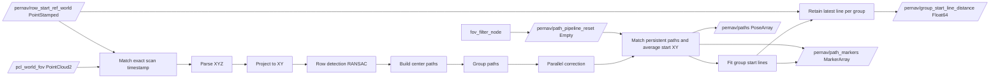
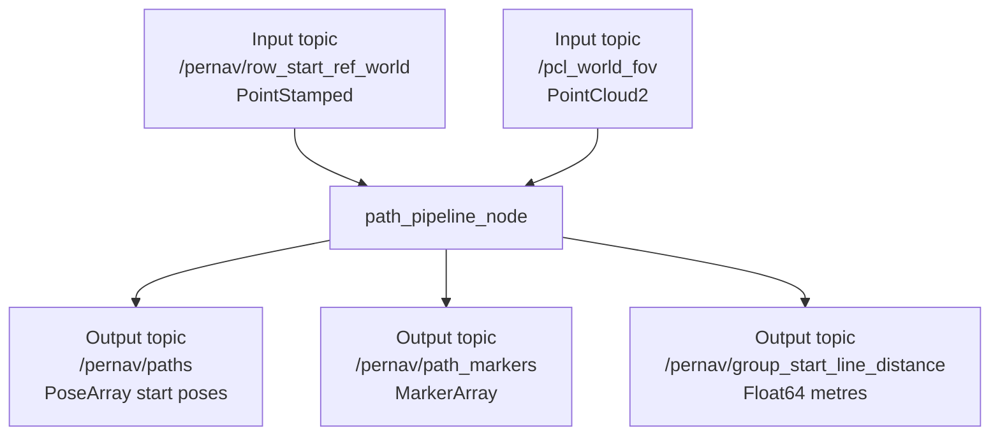
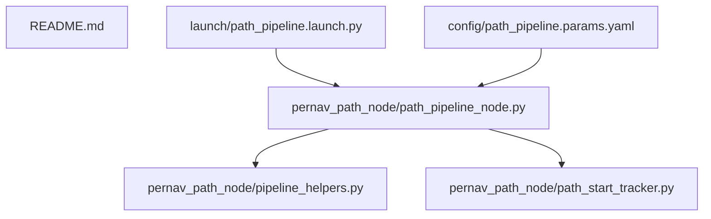

# pernav_path_node

Compact ROS2 package for vineyard path extraction from lidar PointCloud2.

## Quick start

Terminal A (build + launch):

```bash
cd /home/burakerdogan/pernav_project/ros2_ws
source /opt/ros/humble/setup.bash
colcon build --packages-select pernav_path_node
source install/setup.bash
ros2 launch pernav_path_node path_pipeline.launch.py
```

Terminal B (play bag):

```bash
cd /home/burakerdogan/pernav_project/ros2_ws
source /opt/ros/humble/setup.bash
source install/setup.bash
ros2 bag play -l ../data/SPE_2026-06-11_Linden/rosbag2/rosbag2_0.mcap
```

## Pipeline at a glance



## Runtime flow (short)

1. Match the cloud to its world-frame row-start reference by exact timestamp, then parse finite XYZ.
2. Project the already-filtered world-frame cloud to XY.
3. Detect continuous row segments with iterative RANSAC, orienting starts toward the matched reference.
4. Pair nearby rows to create center paths.
5. Group paths by angle and distance.
6. Use the longest path per group as reference and align others in parallel.
7. Match corrected paths across scans and update their running mean start X/Y.
8. Fit one start-line per group from the confirmed, averaged path starts.
9. Retain the latest finite start line for each group and publish the shortest
   XY distance from the synchronized world reference to those finite segments.
10. When that distance crosses from above to at or below the configured stop
    threshold, latch row/path detection off and freeze the last confirmed geometry.
11. Publish the current or frozen confirmed paths and RViz markers.

The tractor-relative rectangular FOV crop and chassis exclusion are configured in
`rearaxle_to_world_node`, before the rear-axle-to-world transform. Both are disabled
by default. This node retains finite-point validation but applies no tractor-relative crop.

The rear-axle reference parameters `row_start_ref_x/y` now belong to
`rearaxle_to_world_node`. This node subscribes to `row_start_ref_topic`
(default `/pernav/row_start_ref_world`, `geometry_msgs/msg/PointStamped`).
Both inputs must use the `world` frame. Either message can arrive first; each
stream buffers up to `row_start_ref_queue_size` messages (default 100), evicting
the oldest arrivals when full. There is no fallback to a fixed or latest reference.
Record/replay the reference topic alongside `/pcl_world_fov`; older recordings
without it need to be reprocessed from the rear-axle cloud and pose streams.

## Main interfaces



`/pernav/group_start_line_distance` begins publishing after the first valid
group start line is formed. It reports the unsigned shortest XY distance in
metres from the synchronized `/pernav/row_start_ref_world` point to the nearest
retained finite line segment. A group's retained segment is updated when that
group is detected again and survives scans with no group line. Retained lines
clear when time moves backward or the node restarts.

With `enable_group_start_distance_stop: true`, an above-to-below crossing of
`group_start_distance_stop_threshold` (default `0.2` m) stops subsequent row and
path searches. The node republishes the last nonempty confirmed path set and its
group start lines while the reference-to-line distance continues updating. This
stop is latched: moving above the threshold does not restart detection. A node
restart, backward timestamp, or `/pernav/path_pipeline_reset` event clears the
latch and cached geometry. The FOV node sends that event when an armed group-start
distance rises through its `5.0 m` deactivation threshold. This permits the next
FOV cycle to detect and track a fresh set of paths.

## Where to tune parameters

Use:
- [ros2_ws/src/pernav_path_node/config/path_pipeline.params.yaml](ros2_ws/src/pernav_path_node/config/path_pipeline.params.yaml)

Loaded automatically by:
- [ros2_ws/src/pernav_path_node/launch/path_pipeline.launch.py](ros2_ws/src/pernav_path_node/launch/path_pipeline.launch.py)

Most important groups:
1. Row detection thresholds
2. Path width and minimum length
3. Grouping and parallel correction thresholds
4. Tracking, confirmation, and averaging settings
5. Publisher and marker settings

| Parameter | Default | Meaning |
| --- | ---: | --- |
| `enable_group_start_distance_stop` | `true` | Enable the latched falling-threshold detection stop |
| `group_start_distance_stop_threshold` | `0.2` m | Stop after distance moves from above to at or below this value |
| `path_pipeline_reset_topic` | `/pernav/path_pipeline_reset` | Completed-FOV event that clears all per-cycle detection state |

## Persistent path starts

`enable_path_start_tracking: true` enables tracking after parallel correction.
Per-scan `path_id` values are not used to associate detections. Matching compares
world-frame start positions against stored averages and gates directed heading
differences (a 180-degree reversal is not the same heading). A global one-to-one
assignment maximizes the number of admissible matches, then minimizes total cost.
The cost is distance plus `0.25 * tracking_max_distance * angle / max_angle`.
Near-equal competing matches are withheld using the ambiguity margin. Unassigned
detections that could match an existing track do not spawn duplicate tracks.

Each matched observation updates its track with the cumulative arithmetic mean:

```text
count += 1
mean_x += (detected_x - mean_x) / count
mean_y += (detected_y - mean_y) / count
```

Only X/Y are averaged. Z remains zero in the PoseArray. The current corrected
path segment is translated to start at the average, preserving its current heading
and length. Group entrance lines are fitted again using these averaged starts.

| Parameter | Default | Meaning |
| --- | ---: | --- |
| `enable_path_start_tracking` | `true` | Enable association and averaging; false publishes per-scan paths |
| `tracking_max_distance` | `1.0` m | Maximum start-to-average distance for a match |
| `tracking_max_heading_deg` | `20.0` degrees | Maximum directed heading difference |
| `tracking_min_observations` | `3` | Observations needed before a new track is published; 1 publishes immediately |
| `tracking_candidate_max_missed_scans` | `5` | Discard tentative tracks after more than this many consecutive missed scans |
| `tracking_ambiguity_margin` | `0.15` m | Withhold competing matches closer than this cost difference; 0 disables this check |

Missing confirmed paths keep their averages and counts internally, but only
confirmed paths observed in the current scan are published. A scan without
confirmed matches publishes an empty PoseArray. The observation count increases
only for matched detections, never for misses.

The live plot and video draw **all stored confirmed starts as green dots**, even
when a path is missing or the filtered cloud is empty. Missing paths retain their
last average position and their ID/count label; path segments still represent
current detections. With autoscaling enabled, bounds include both the current
cloud and stored confirmed starts. With fixed limits, only dots inside those
limits are visible. Dots clear when tracking resets or the node restarts.

The plot shows persistent `p<ID>`
labels and `n=<observation count>`; path RViz marker IDs use the same persistent IDs.
The PoseArray is sorted by track ID, but **does not carry IDs**: its array index
must not be treated as a persistent identity when paths appear or disappear.

Tracking state is held in memory. Restarting the node or receiving a backward
scan timestamp resets it, allowing a new bag replay to start fresh. Duplicate
consecutive timestamps do not count twice. Start a new node for a different field
or world origin. Thresholds are initial tuning values: keep the distance limit
below neighboring-path spacing while allowing expected detection noise. Changes
are read at node startup, so restart after editing the YAML.

## Plot video recording

The launch YAML enables `enable_plot_video: true`. Recording uses the same plot
as the live window, including averaged starts, persistent IDs and observation
counts when tracking is enabled. It also works without a GUI: set
`enable_notebook_plot: false` and keep `enable_plot_video: true`.

| Parameter | YAML value | Meaning |
| --- | --- | --- |
| `enable_notebook_plot` | `true` | Show the live plot window |
| `enable_plot_video` | `true` | Stream rendered frames to an H.264 MP4 (Python default is false) |
| `plot_video_output_path` | `output/pernav_path_plot_{timestamp}.mp4` | Output filename; timestamp is expanded once per run |
| `plot_video_fps` | `1.0` | Fixed playback frame rate |
| `plot_every_n_frames` | `10` | Render and record every Nth synchronized scan |

Relative paths are resolved against the node's working directory. If launched
from `ros2_ws`, the default saves under `ros2_ws/output/`. Use an absolute path to
choose a fixed folder. Parent folders are created automatically; an existing file
is never intentionally overwritten. The resolved filename is logged at startup.

One video frame is written for every rendered plot. Frames are streamed to FFmpeg,
not accumulated in memory. Playback is **not timestamp-resampled**: duration is
recorded frame count divided by `plot_video_fps`. For 10 Hz scans and every 10th
scan, 1 fps is approximately real-time. For every scan at 10 Hz, use
`plot_every_n_frames: 1` and `plot_video_fps: 10.0`. Pauses or gaps in incoming
messages do not add frames. Recording starts only once synchronized clouds reach
the plotting stage (after the frozen FOV activates).

Stop the node normally with **Ctrl+C** to finalize the MP4. The node logs the saved
path and frame count. A run with no rendered frames creates no video. FFmpeg must
be installed; encoder or file errors disable recording with a warning while path
processing continues. Force-killing the process may leave an incomplete MP4.
Restart the node after changing these YAML parameters.

## Regression checks

From the project root, with ROS 2 and the workspace sourced:

```bash
python3 -m pytest tests -q
```

Checks include reordered IDs, arithmetic averages, one-to-one assignment,
ambiguous matches, missing paths, candidate expiry, heading wrap, timestamp rewind,
consistency between published poses, markers, and fitted entrance lines, and actual
MP4 encoding, decoding, frame rate, and finalization on Ctrl+C.

## Code map



Files:
- [pernav_path_node/path_start_tracker.py](pernav_path_node/path_start_tracker.py): persistent association and XY averaging
- [ros2_ws/src/pernav_path_node/pernav_path_node/path_pipeline_node.py](ros2_ws/src/pernav_path_node/pernav_path_node/path_pipeline_node.py)
- [ros2_ws/src/pernav_path_node/pernav_path_node/pipeline_helpers.py](ros2_ws/src/pernav_path_node/pernav_path_node/pipeline_helpers.py)
- [ros2_ws/src/pernav_path_node/package.xml](ros2_ws/src/pernav_path_node/package.xml)

## Quick checks

```bash
ros2 node list
ros2 topic list
ros2 topic hz /pernav/paths
ros2 topic hz /pernav/path_markers
ros2 topic echo /pernav/group_start_line_distance
```

If `ros2 topic hz` exits with code 2, usually the topic is not active yet or the terminal is not sourced.
