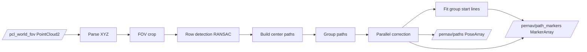
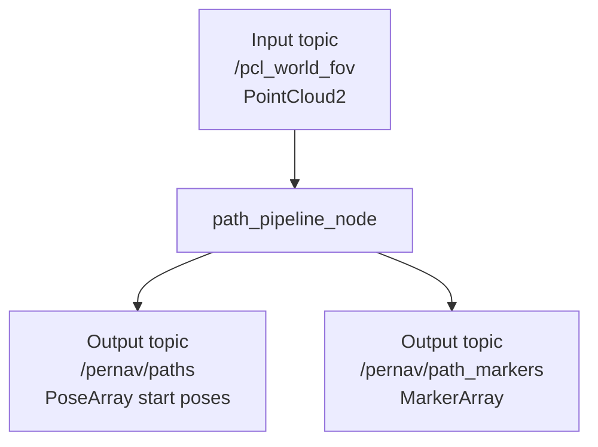
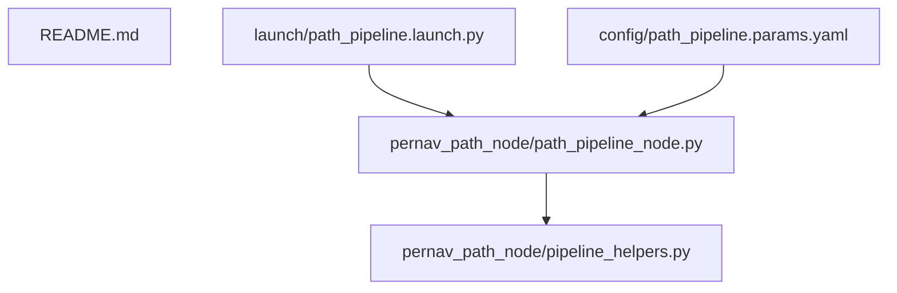

# pernav_path_node

Compact ROS2 package for vineyard path extraction from lidar PointCloud2.

## Quick start

Terminal A (build + launch):

```bash
cd /home/burakerdogan/pernav_project/ros2_ws
source /opt/ros/humble/setup.bash
colcon build --packages-select pernav_path_node
source install/setup.bash
ros2 launch pernav_path_node path_pipeline.launch.py
```

Terminal B (play bag):

```bash
cd /home/burakerdogan/pernav_project/ros2_ws
source /opt/ros/humble/setup.bash
source install/setup.bash
ros2 bag play -l ../data/SPE_2026-06-11_Linden/rosbag2/rosbag2_0.mcap
```

## Pipeline at a glance



## Runtime flow (short)

1. Parse PointCloud2 and keep finite XYZ.
2. Project to XY and crop by configured FOV.
3. Detect continuous row segments with iterative RANSAC.
4. Pair nearby rows to create center paths.
5. Group paths by angle and distance.
6. Use the longest path per group as reference and align others in parallel.
7. Fit one start-line per group from corrected path starts.
8. Publish path message and RViz markers.

## Main interfaces



## Where to tune parameters

Use:
- [ros2_ws/src/pernav_path_node/config/path_pipeline.params.yaml](ros2_ws/src/pernav_path_node/config/path_pipeline.params.yaml)

Loaded automatically by:
- [ros2_ws/src/pernav_path_node/launch/path_pipeline.launch.py](ros2_ws/src/pernav_path_node/launch/path_pipeline.launch.py)

Most important groups:
1. FOV limits
2. Row detection thresholds
3. Path width and minimum length
4. Grouping and parallel correction thresholds
5. Publisher and marker settings

## Code map



Files:
- [ros2_ws/src/pernav_path_node/pernav_path_node/path_pipeline_node.py](ros2_ws/src/pernav_path_node/pernav_path_node/path_pipeline_node.py)
- [ros2_ws/src/pernav_path_node/pernav_path_node/pipeline_helpers.py](ros2_ws/src/pernav_path_node/pernav_path_node/pipeline_helpers.py)
- [ros2_ws/src/pernav_path_node/package.xml](ros2_ws/src/pernav_path_node/package.xml)

## Quick checks

```bash
ros2 node list
ros2 topic list
ros2 topic hz /pernav/paths
ros2 topic hz /pernav/path_markers
```

If `ros2 topic hz` exits with code 2, usually the topic is not active yet or the terminal is not sourced.
