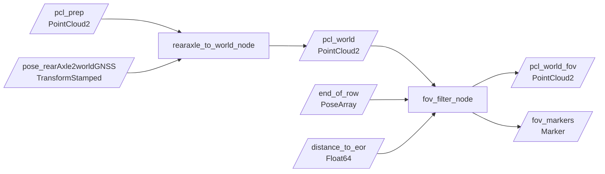

# pernav_world_transform

ROS 2 Python package for transforming vineyard LiDAR data into the `world` frame and creating a frozen world-frame field of view (FOV) near the end of a row.

## Pipeline



The output of this package is the input of `pernav_path_node`:

```text
/pcl_world_fov -> path_pipeline_node -> /pernav/paths
```

## Build

From the ROS 2 workspace:

```bash
cd /home/burak.erdogan/Desktop/Projects/Pernav/ros2_ws
source /opt/ros/jazzy/setup.bash
colcon build --packages-select pernav_world_transform --symlink-install
source install/setup.bash
```

## Run

Start each node in a separate sourced terminal before playing a rosbag.

Transform the point cloud into the world frame:

```bash
ros2 run pernav_world_transform rearaxle_to_world_node
```

Create and apply the frozen FOV:

```bash
ros2 run pernav_world_transform fov_filter_node
```

Play the sample bag in another terminal:

```bash
cd /home/burak.erdogan/Desktop/Projects/Pernav/ros2_ws
source /opt/ros/jazzy/setup.bash
source install/setup.bash
ros2 bag play ../data/rosbag2_2026_07_17-16_24_41_0.mcap
```

## `rearaxle_to_world_node`

This node matches each `/pcl_prep` scan to the closest buffered rear-axle pose. If the timestamps are close enough, it applies the pose rotation and translation to every finite XYZ point and publishes a new world-frame cloud.

### Interfaces

| Direction | Topic | Type |
| --- | --- | --- |
| Input | `/pcl_prep` | `sensor_msgs/msg/PointCloud2` |
| Input | `/pose_rearAxle2worldGNSS` | `geometry_msgs/msg/TransformStamped` |
| Output | `/pcl_world` | `sensor_msgs/msg/PointCloud2` |

The output has `header.frame_id: world` and contains XYZ fields. Other fields from the input cloud are not copied.

### Parameters

| Parameter | Default | Meaning |
| --- | ---: | --- |
| `input_pointcloud_topic` | `/pcl_prep` | Rear-axle-frame input cloud |
| `pose_topic` | `/pose_rearAxle2worldGNSS` | Rear-axle-to-world pose stream |
| `output_pointcloud_topic` | `/pcl_world` | Transformed output cloud |
| `max_pose_time_difference` | `0.1` | Maximum cloud-to-pose timestamp difference in seconds |
| `pose_buffer_size` | `100` | Maximum number of poses retained for matching |

The node uses the nearest pose; it does not interpolate between poses. A scan is skipped when there is no pose or the closest pose is too far away in time.

Example override:

```bash
ros2 run pernav_world_transform rearaxle_to_world_node --ros-args \
  -p max_pose_time_difference:=0.2 \
  -p pose_buffer_size:=200
```

## `fov_filter_node`

This node receives end-of-row poses and fits a 2D line through them using SVD. When `/distance_to_eor` crosses from above the activation threshold to at or below it, the node creates and freezes a rectangular corridor in the world frame.

Once active, every `/pcl_world` scan is filtered against that frozen corridor and published on `/pcl_world_fov`.

### Interfaces

| Direction | Topic | Type |
| --- | --- | --- |
| Input | `/pcl_world` | `sensor_msgs/msg/PointCloud2` |
| Input | `/end_of_row` | `geometry_msgs/msg/PoseArray` |
| Input | `/distance_to_eor` | `example_interfaces/msg/Float64` |
| Output | `/pcl_world_fov` | `sensor_msgs/msg/PointCloud2` |
| Output | `/fov_markers` | `visualization_msgs/msg/Marker` |

The FOV requires at least two finite end-of-row poses. It remains fixed until the node is restarted.

### Parameters

| Parameter | Default | Meaning |
| --- | ---: | --- |
| `input_pointcloud_topic` | `/pcl_world` | World-frame input cloud |
| `end_of_row_topic` | `/end_of_row` | Points used to fit the end-of-row line |
| `distance_topic` | `/distance_to_eor` | Distance used for activation |
| `output_pointcloud_topic` | `/pcl_world_fov` | Filtered world-frame cloud |
| `activation_distance` | `4.0` | Activate when distance crosses downward through this value, in metres |
| `upper_offset` | `4.0` | Corridor extent on the positive-normal side, in metres |
| `lower_offset` | `-0.5` | Corridor extent on the negative-normal side, in metres |
| `fov_line_extension` | `0.0` | Extension beyond both ends of the fitted line, in metres |
| `debug` | `true` | Enable periodic point-count logging |
| `plot_output_path` | `fov_world_snapshot.png` | Snapshot path created when the FOV is frozen |

Example override:

```bash
ros2 run pernav_world_transform fov_filter_node --ros-args \
  -p activation_distance:=5.0 \
  -p lower_offset:=-1.0 \
  -p upper_offset:=5.0 \
  -p fov_line_extension:=2.0
```

## Verification

Check that the nodes and topics are active:

```bash
ros2 node list
ros2 topic hz /pcl_world
ros2 topic hz /pcl_world_fov
ros2 topic echo /pcl_world --field header --once
ros2 topic echo /pcl_world_fov --field header --once
```

Useful log messages include the cloud/pose timestamp difference, transformed point count, FOV geometry, and number of points retained by the FOV.

## RViz and TF

Use `world` as the RViz fixed frame and add these displays:

- `PointCloud2` on `/pcl_world`
- `PointCloud2` on `/pcl_world_fov`
- `Marker` on `/fov_markers`

The package labels its output clouds as `world`, but it does not currently broadcast the moving `world -> rearAxle` transform on `/tf`. The pose arriving on `/pose_rearAxle2worldGNSS` is a regular topic and is used numerically; it is not automatically part of the TF tree. A dynamic TF broadcaster is required to display the moving tractor and world-frame clouds together in RViz.

## Code map

- [`pernav_world_transform/rearaxle_to_world_node.py`](pernav_world_transform/rearaxle_to_world_node.py): pose buffering, timestamp matching, and point transformation
- [`pernav_world_transform/fov_filter_node.py`](pernav_world_transform/fov_filter_node.py): FOV activation, geometry, filtering, markers, and snapshot generation
- [`setup.py`](setup.py): ROS 2 console entry points
- [`package.xml`](package.xml): package dependencies and metadata

## Current limitations

- The cloud transform uses nearest-pose matching rather than interpolation.
- Output clouds retain XYZ only.
- The FOV is created once and cannot be reset without restarting the node.
- The package has no launch file or shared YAML parameter file.
- The world-to-tractor transform is not broadcast to `/tf`.
