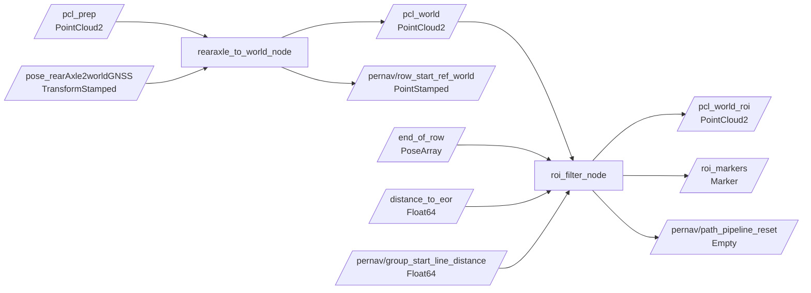

# pernav_world_transform

ROS 2 Python package for transforming vineyard LiDAR data into the `world` frame and creating a frozen world-frame field of view (ROI) near the end of a row.

## Pipeline



The output of this package is the input of `pernav_path_node`:

```text
/pcl_world_roi + /pernav/row_start_ref_world -> path_pipeline_node -> /pernav/paths
```

## Build

From the ROS 2 workspace:

```bash
cd /home/burak.erdogan/Desktop/Projects/Pernav/ros2_ws
source /opt/ros/jazzy/setup.bash
colcon build --packages-select pernav_world_transform --symlink-install
source install/setup.bash
```

## Run

Start each node in a separate sourced terminal before playing a rosbag.

Transform the point cloud into the world frame:

```bash
ros2 run pernav_world_transform rearaxle_to_world_node
```

Create and apply the frozen ROI:

```bash
ros2 run pernav_world_transform roi_filter_node
```

Play the sample bag in another terminal:

```bash
cd /home/burak.erdogan/Desktop/Projects/Pernav/ros2_ws
source /opt/ros/jazzy/setup.bash
source install/setup.bash
ros2 bag play ../data/rosbag2_2026_07_17-16_24_41_0.mcap
```

## `rearaxle_to_world_node`

This node matches each `/pcl_prep` scan to the closest buffered rear-axle pose. If the timestamps are close enough, it extracts finite XYZ points, optionally applies the rectangular ROI crop and chassis exclusion in the rear-axle frame, then applies the pose rotation and translation and publishes a new world-frame cloud. Both spatial filters are disabled by default.

### Interfaces

| Direction | Topic | Type |
| --- | --- | --- |
| Input | `/pcl_prep` | `sensor_msgs/msg/PointCloud2` |
| Input | `/pose_rearAxle2worldGNSS` | `geometry_msgs/msg/TransformStamped` |
| Output | `/pcl_world` | `sensor_msgs/msg/PointCloud2` |
| Output | `/pernav/row_start_ref_world` | `geometry_msgs/msg/PointStamped` |

The output has `header.frame_id: world` and contains XYZ fields. Other fields from the input cloud are not copied.

For each published cloud, the node also transforms `(row_start_ref_x, row_start_ref_y, 0)`
using the same matched pose. It publishes a `PointStamped` in `world` with the
**LiDAR scan timestamp**, allowing the path node to match it exactly after ROI filtering.
The reference is published even if the optional spatial filters remove all points.
Skipped scans (missing/distant pose or no valid input XYZ) publish neither message.

To change the rear-axle reference, restart this node with parameter overrides:

```bash
ros2 run pernav_world_transform rearaxle_to_world_node --ros-args \
  -p row_start_ref_x:=3.0 -p row_start_ref_y:=0.0
```

### Parameters

| Parameter | Default | Meaning |
| --- | ---: | --- |
| `input_pointcloud_topic` | `/pcl_prep` | Rear-axle-frame input cloud |
| `pose_topic` | `/pose_rearAxle2worldGNSS` | Rear-axle-to-world pose stream |
| `output_pointcloud_topic` | `/pcl_world` | Transformed output cloud |
| `max_pose_time_difference` | `0.1` | Maximum cloud-to-pose timestamp difference in seconds |
| `pose_buffer_size` | `100` | Maximum number of poses retained for matching |
| `row_start_ref_x`, `row_start_ref_y` | `3.0`, `0.0` | Row-start reference in rear-axle coordinates, in metres (Z = 0) |
| `row_start_ref_topic` | `/pernav/row_start_ref_world` | Output topic for the transformed reference |
| `enable_rectangular_roi_filter` | `false` | Enable the rear-axle-frame XY crop before transformation |
| `roi_x_min`, `roi_x_max` | `0.0`, `20.0` | Inclusive ROI X bounds in metres |
| `roi_y_min`, `roi_y_max` | `-10.0`, `10.0` | Inclusive ROI Y bounds in metres |
| `enable_chassis_exclusion` | `false` | Remove the tractor chassis XY box before transformation |
| `chassis_exclusion_x_min`, `chassis_exclusion_x_max` | `0.0`, `4.0` | Chassis X bounds in metres; boundary points are removed |
| `chassis_exclusion_y_min`, `chassis_exclusion_y_max` | `-1.0`, `1.0` | Chassis Y bounds in metres; boundary points are removed |

These filter parameters moved from `pernav_path_node` to this node. Their bounds are
relative to the rear axle, and Z is preserved. With both filters disabled, all finite
input points proceed to the transform. If enabled filters remove every point, an
empty world-frame cloud is published. The downstream frozen world ROI is unchanged.

To check each filter separately, restart the transform node with one enabled:

```bash
ros2 run pernav_world_transform rearaxle_to_world_node --ros-args \
  -p enable_rectangular_roi_filter:=true
```

```bash
ros2 run pernav_world_transform rearaxle_to_world_node --ros-args \
  -p enable_chassis_exclusion:=true
```

Running without these overrides keeps both disabled. Parameters are read at startup.

The node uses the nearest pose; it does not interpolate between poses. A scan is skipped when there is no pose or the closest pose is too far away in time.

Example override:

```bash
ros2 run pernav_world_transform rearaxle_to_world_node --ros-args \
  -p max_pose_time_difference:=0.2 \
  -p pose_buffer_size:=200
```

## `roi_filter_node`

This node receives end-of-row poses and fits a 2D line through them using SVD. When `/distance_to_eor` crosses from above the activation threshold to at or below it, the node creates and freezes a rectangular corridor in the world frame.

Once active, every `/pcl_world` scan is filtered against that frozen corridor and published on `/pcl_world_roi`.

Each active ROI is one cycle. The group-start distance first has to cross from
above to at or below `group_start_near_threshold`. That arms deactivation. When
the distance then rises through `deactivation_distance`, the node stops publishing
`/pcl_world_roi`, deletes the ROI marker, clears the frozen geometry and stale
end-of-row estimate, and publishes `/pernav/path_pipeline_reset`.

`/distance_to_eor` provides an independent fallback when no group-start distance
is available. After an ROI is created, this fallback first arms only when the
distance reaches `eor_deactivation_distance`. Its next falling crossing through
that threshold ends the ROI cycle. Requiring this rearm prevents the approximately
1 m activation value from immediately clearing the new ROI. After either trigger,
the node waits
for the next falling activation edge on `/distance_to_eor` and creates a new ROI
from a fresh end-of-row estimate. A group-start distance that starts above the
deactivation distance cannot prematurely end a cycle because deactivation has
not been armed yet.

### Interfaces

| Direction | Topic | Type |
| --- | --- | --- |
| Input | `/pcl_world` | `sensor_msgs/msg/PointCloud2` |
| Input | `/end_of_row` | `geometry_msgs/msg/PoseArray` |
| Input | `/distance_to_eor` | `example_interfaces/msg/Float64` or `std_msgs/msg/Float64` |
| Input | `/pernav/group_start_line_distance` | `std_msgs/msg/Float64` |
| Output | `/pcl_world_roi` | `sensor_msgs/msg/PointCloud2` |
| Output | `/roi_markers` | `visualization_msgs/msg/Marker` |
| Output | `/roi_markers_axes` | `visualization_msgs/msg/Marker` |
| Output | `/pernav/path_pipeline_reset` | `std_msgs/msg/Empty` |

Invalid end-of-row XY entries are discarded; the ROI requires at least two remaining finite poses. The geometry remains fixed for its active cycle.

### Parameters

| Parameter | Default | Meaning |
| --- | ---: | --- |
| `input_pointcloud_topic` | `/pcl_world` | World-frame input cloud |
| `end_of_row_topic` | `/end_of_row` | Points used to fit the end-of-row line |
| `distance_topic` | `/distance_to_eor` | Distance used for activation |
| `distance_message_type` | `example_interfaces/msg/Float64` | Distance topic type; also accepts `std_msgs/msg/Float64` |
| `output_pointcloud_topic` | `/pcl_world_roi` | Filtered world-frame cloud |
| `pose_topic` | `/pose_rearAxle2worldGNSS` | Tractor pose used to select the closest EOR point |
| `axes_marker_topic` | `/roi_markers_axes` | Experimental repeated driving-axis line marker |
| `activation_distance` | `1.0` | Activate when distance crosses downward through this value, in metres |
| `upper_offset` | `4.0` | Corridor extent on the positive-normal side, in metres |
| `lower_offset` | `-0.5` | Corridor extent on the negative-normal side, in metres |
| `roi_line_extension` | `10.0` | Extension beyond both ends of the fitted line, in metres |
| `group_start_distance_topic` | `/pernav/group_start_line_distance` | Distance used to complete an active cycle |
| `group_start_near_threshold` | `0.2` | Falling threshold that arms ROI deactivation, in metres |
| `deactivation_distance` | `5.0` | Rising threshold that ends an armed ROI cycle, in metres |
| `eor_deactivation_distance` | `10.0` | Rearm level and subsequent falling threshold for the independent `/distance_to_eor` deactivation fallback, in metres |
| `path_pipeline_reset_topic` | `/pernav/path_pipeline_reset` | Reset event published when a cycle ends |
| `debug` | `true` | Enable periodic point-count logging |
| `plot_output_path` | `roi_world_snapshot.png` | First-cycle snapshot; later cycles add `_cycle_NNN` |

Example override:

```bash
ros2 run pernav_world_transform roi_filter_node --ros-args \
  -p activation_distance:=5.0 \
  -p lower_offset:=-1.0 \
  -p upper_offset:=5.0 \
  -p roi_line_extension:=2.0
```

## Verification

Check that the nodes and topics are active:

```bash
ros2 node list
ros2 topic hz /pcl_world
ros2 topic echo /pernav/row_start_ref_world --once
ros2 topic hz /pcl_world_roi
ros2 topic echo /pernav/path_pipeline_reset
ros2 topic echo /pcl_world --field header --once
ros2 topic echo /pcl_world_roi --field header --once
```

Useful log messages include the cloud/pose timestamp difference, transformed point count, ROI geometry, and number of points retained by the ROI.

## RViz and TF

Use `world` as the RViz fixed frame and add these displays:

- `PointCloud2` on `/pcl_world`
- `PointCloud2` on `/pcl_world_roi`
- `Marker` on `/roi_markers`
- `Marker` on `/roi_markers_axes`

The axis-grid marker selects the EOR pose closest to the tractor when the ROI is
created. It compares that pose's local X and Y axes with the pre-turn vector from
the tractor to the EOR point, freezes the better-aligned axis, and repeats it at
the median EOR-point spacing across the full ROI.

The package labels its output clouds as `world`, but it does not currently broadcast the moving `world -> rearAxle` transform on `/tf`. The pose arriving on `/pose_rearAxle2worldGNSS` is a regular topic and is used numerically; it is not automatically part of the TF tree. A dynamic TF broadcaster is required to display the moving tractor and world-frame clouds together in RViz.

## Code map

- [`pernav_world_transform/rearaxle_to_world_node.py`](pernav_world_transform/rearaxle_to_world_node.py): pose buffering, timestamp matching, and point transformation
- [`pernav_world_transform/roi_filter_node.py`](pernav_world_transform/roi_filter_node.py): ROI activation, geometry, filtering, markers, and snapshot generation
- [`setup.py`](setup.py): ROS 2 console entry points
- [`package.xml`](package.xml): package dependencies and metadata

## Current limitations

- The cloud transform uses nearest-pose matching rather than interpolation.
- Output clouds retain XYZ only.
- The package has no launch file or shared YAML parameter file.
- The world-to-tractor transform is not broadcast to `/tf`.
